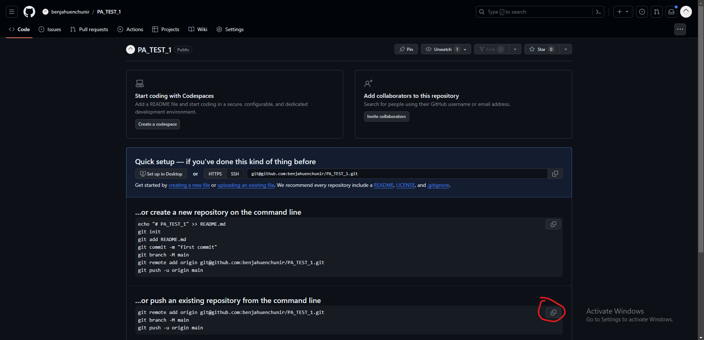

# PA_TEST

Guia experiencia Programación avanzada

## Pasos

### 1: Crea una cuenta de GitHub

1. Visita [GitHub](https://github.com/)
2. Registrate con tu mail uc

### 2: Crea un entorno de Codespaces

1. Visita [GitHub Codespaces](https://github.com/codespaces)
2. Crea un entorno utilizando la plantilla en blanco

### 3: Instala python en el entorno

1. Apreta el boton de extensiones de la barra lateral y busca python
2. Haz click en instalar
    

### 4: Crea tu repositorio

1. **Uno** de los integrantes debe crear un repositorio de github, en la pagina prinipal de [GitHub](https://github.com/) busca la sección de `Start writing code` y crea un repositorio publico llamado...
    
    

2. Invita a los otros integrantes de tu grupo
    
    

### 5. Clona el repositorio que te entregamos

1. El integrante que haya creado el repositorio debe ingresar al [repositorio que proporcionamos](https://github.com/benjahuenchunir/PA_TEST), clickear el boton verde que dice `Code` y copiar el link del repositorio en https
   
   

2. Escribe `git clone link_copiado` en la terminal de codespaces, deberían aparecer la carpeta `PA_TEST`

3. Ejecuta el comando `git remote remove origin` para desvincular el repositorio clonado de su origen

4. Vuelve a tu repositorio y copia el codigo que de la seccion que dice push an existing repository y ejecutalo en la terminal <!-- TODO REvisar esta parte porque creo que falla https://stackoverflow.com/questions/77466911/i-am-getting-an-error-trying-to-do-a-git-push-to-a-repository-in-my-github-codes -->
    
    

5. Si recargas la pagina de tu repositorio deberias ver que aparecen todos los archivos

6. El resto de los integrantes debe ahora clonar el repositorio que creaste haciendo solo los pasos 1 y 2. El resto no, porque van a estar trabajando sobre el mismo repo y por lo tanto no deben quitar el origen...

### 6. Archivo .gitignore

1. El primer desafio requiere que ingreses tu clave supersecreta. No quieres que esta sea subida a internet. Para esto se usa el archivo git_ignore.

2. Uno de los integrantes debe copiar el `archivo_super_secreto_local.py` y cambiarle el nombre a `archivo_super_secreto.py`. Ahí es donde debera ingresar la clave supersecreta

3. Para evitar que git guarde los cambios de este archivo basta con agregar el nombre del archivo a .gitgnore

4. Guarda los cambios realizados con el comando `git add nombre_archivo` para... o `git add *` para agregar todos los cambios

5. Realiza un commit para confirmar los cambios con el comando `git commit -m "mensaje que describa los cambios"`

6. Esto solo ha sido realizado de forma local, para mandarlos al repositorio remoto se usa el comando `git push`. Si recargas la pagina de tu repositorio deberías ver los cambios

7. El resto de los integrantes no tiene estos cambios en su entorno local. Para recuperarlos se usa el comando `git pull`

### 6. Soluciona los desafios y guarda los cambios

1. Cada integrante debe solucionar uno de los desafios. Ir guardando los cambios cuando sea necesario y hacer push. No es necesario que esperen que uno termine y haga push antes de hacer sus cambios. Git automaticamente se encargara de combianr los codigos??
<!-- TODO revisar el merge? -->

# Otras ideas

- Alternativa: el boton verde tiene una opcion para clonar un repo autoamticamente en codespaces
- hacer que pusheen el archivo vacio cuando terminen y hagan rollback
- Enseñar a hacerlo con la secion git integrada de vscode
- git status
- conflict merge
